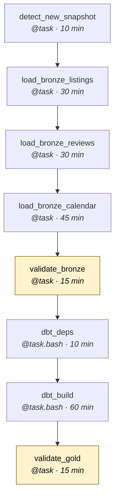
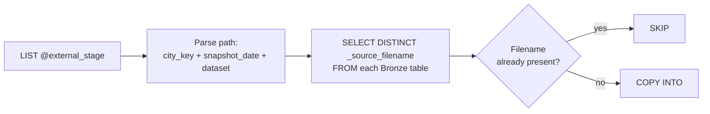
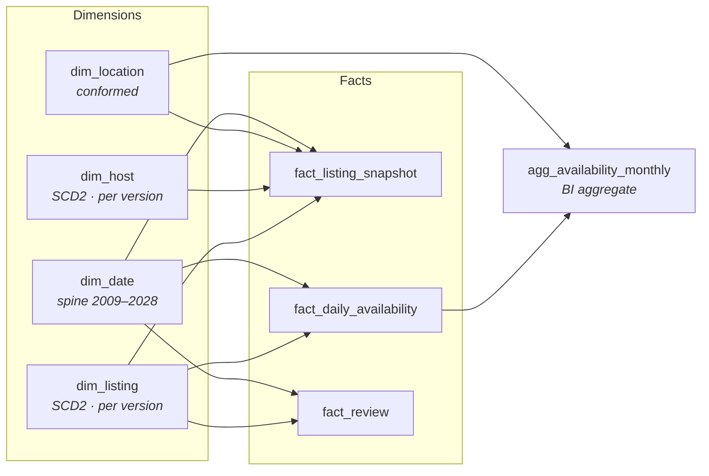
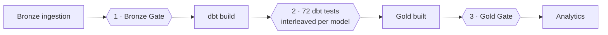
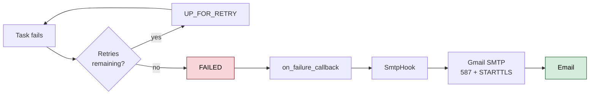

# Rental Market Intelligence Platform

**A production-shaped Data Engineering pipeline that turns monthly rental-market snapshots into an analytical Snowflake warehouse.**

```
AWS S3  →  Airflow  →  Snowflake Bronze  →  dbt Silver  →  SCD Type 2  →  Kimball Gold  →  Quality Gates  →  Analytics
```


---

## Overview

The **Rental Market Intelligence Platform** transforms large monthly rental-market snapshots into a **historical, reliable and analytics-ready data warehouse**. Since the source provides complete snapshots rather than change data, the platform uses **AWS S3** as the landing zone and **Apache Airflow** to detect and ingest only genuinely new files into **Snowflake Bronze**, making the pipeline incremental and idempotent.

**dbt** then cleans and standardises the data in Silver, reconstructs historical listing and host changes using **SCD Type 2**, and builds a **Kimball-style Gold warehouse** with dimensions, fact tables and BI-ready aggregates. Multiple **data-quality gates and dbt tests** protect the pipeline from invalid, duplicated or inconsistent data, while Airflow provides retries, timeouts and failure alerting.

The result is an end-to-end platform that turns static monthly snapshots into a **historical rental-market intelligence layer** capable of analysing price evolution, host behaviour, availability patterns and neighbourhood trends over time — while demonstrating core Data Engineering practices such as **incremental processing, idempotency, dimensional modelling, data quality, orchestration, reliability and secure configuration**.

## Business Problem

The source is a photograph, but the questions are all about motion.

| The question a analyst wants to ask | Why the raw source cannot answer it |
|---|---|
| "How did this listing's price change?" | `calendar.csv` price is **100% null**. The only price signal is one current value per listing per snapshot. |
| "What is the real occupancy?" | There is **no booking data**. Occupancy must be inferred from availability transitions and reviews (a lower-bound proxy for completed stays). |
| "Which neighbourhoods are tightening?" | Requires comparing snapshots — which requires history the source never provides. |

On top of that, the data itself resists naive handling:

- **Volume.** One calendar snapshot is ~13.2M rows; two is ~26.5M. Materialising that as a view, or reloading it monthly, does not survive contact with reality.
- **Overlap.** Each snapshot re-sends nearly all prior reviews. ~1.96M raw review rows deduplicate to ~1.0M distinct reviews.
- **Dirty encodings.** Prices arrive as `"$1,250.00"`, booleans as `t`/`f`, percentages as `"100%"`.
- **Poisoned values.** `maximum_nights` contains `2147483647` — a 2³¹−1 overflow placeholder meaning "no maximum" — which destroys every average it touches.
- **Parsing traps.** `listings.csv` contains newlines inside quoted free-text fields, so line-counting reports 77,866 rows where there are really **36,403**.

## Objectives

1. **Ingest incrementally and idempotently** — re-running against unchanged source data must be a verifiable no-op.
2. **Separate cleaning from interpretation** — Silver fixes what is *wrong*; Gold decides what it *means*.
3. **Reconstruct history** the source does not provide, using SCD Type 2.
4. **Validate at the boundaries**, not only in the middle.
5. **Let each tool own what it is good at** — dbt owns the transformation DAG, Airflow owns scheduling and recovery.
6. **Keep every secret out of the repository.**
7. **Fail loudly** — a scheduled pipeline that fails silently is indistinguishable from one that never ran.

---

## Architecture

```mermaid
flowchart LR

    SRC["Monthly Snapshot Files<br/>Listings · Reviews · Calendar"]
        --> S3[("AWS S3<br/>Landing Zone")]

    S3 --> STG["Snowflake External Stage<br/>+ Storage Integration"]

    STG --> AF["Apache Airflow 3.1.2<br/>TaskFlow API · LocalExecutor"]

    AF <--> PG[("PostgreSQL 16<br/>Airflow Metadata")]

    AF -->|"COPY INTO<br/>New Files Only"| BR[("BRONZE<br/>Raw + Ingestion Metadata")]

    BR --> VB{{"Bronze<br/>Validation Gate"}}

    VB -->|"PASS"| DBT["dbt Build"]

    DBT --> SI[("SILVER<br/>Cleaned + Typed")]

    SI --> SN[("SNAPSHOTS<br/>SCD Type 2 History")]

    SN --> GO[("GOLD<br/>Kimball Star Schema")]

    GO --> VG{{"Gold<br/>Validation Gate"}}

    VG -->|"PASS"| BI["Analytics / BI"]

    AF -.->|"on_failure_callback"| MAIL["Gmail SMTP<br/>Failure Alerting"]


    %% -----------------------------
    %% ORCHESTRATION
    %% -----------------------------

    subgraph ORCH["ORCHESTRATION — DOCKER COMPOSE"]
        direction TB
        AF
        PG
    end


    %% -----------------------------
    %% SNOWFLAKE
    %% -----------------------------

    subgraph SNOW["SNOWFLAKE DATA WAREHOUSE"]
        direction LR
        BR
        VB
        DBT
        SI
        SN
        GO
        VG
    end


    %% -----------------------------
    %% COLOR PALETTE
    %% -----------------------------

    classDef source fill:#E8F1FF,stroke:#2563EB,stroke-width:2px,color:#0F172A;
    classDef aws fill:#FFF3E0,stroke:#F59E0B,stroke-width:2px,color:#78350F;
    classDef orchestration fill:#F3E8FF,stroke:#9333EA,stroke-width:2px,color:#3B0764;
    classDef bronze fill:#FCE7D6,stroke:#EA580C,stroke-width:2px,color:#7C2D12;
    classDef silver fill:#E5E7EB,stroke:#64748B,stroke-width:2px,color:#1E293B;
    classDef snapshot fill:#DBEAFE,stroke:#3B82F6,stroke-width:2px,color:#1E3A8A;
    classDef gold fill:#FEF3C7,stroke:#D97706,stroke-width:2px,color:#78350F;
    classDef validation fill:#DCFCE7,stroke:#16A34A,stroke-width:2px,color:#14532D;
    classDef dbt fill:#E0F2FE,stroke:#0284C7,stroke-width:2px,color:#0C4A6E;
    classDef bi fill:#E0E7FF,stroke:#4F46E5,stroke-width:2px,color:#312E81;
    classDef alert fill:#FEE2E2,stroke:#DC2626,stroke-width:2px,color:#7F1D1D;


    %% -----------------------------
    %% APPLY COLORS
    %% -----------------------------

    class SRC source;
    class S3,STG aws;
    class AF,PG orchestration;
    class BR bronze;
    class VB,VG validation;
    class DBT dbt;
    class SI silver;
    class SN snapshot;
    class GO gold;
    class BI bi;
    class MAIL alert;
```



> **Core design principle.** Airflow *orchestrates* the dbt project; it never duplicates it. No SQL, model list, or layer ordering is restated in the DAG — all of it lives in the dbt manifest and is derived from `ref()`.

---

## End-to-End Data Flow

| # | Stage | What happens |
|---|---|---|
| 1 | **Source snapshot** | A monthly export produces `listings.csv`, `reviews.csv`, `calendar.csv` |
| 2 | **S3 landing** | Files land at `landing/airbnb/<city_key>/<DD-MM-YYYY>/<dataset>.csv` |
| 3 | **Detection** | `detect_new_snapshot` lists the Snowflake external stage and diffs it against `_source_filename` values already in Bronze |
| 4 | **Bronze ingestion** | Three tasks `COPY INTO` the Bronze tables — **new files only**, each stamped with four metadata columns |
| 5 | **Bronze validation** | Gate: tables readable, non-empty, expected files present, **no file ingested twice** |
| 6 | **dbt deps** | Installs `dbt_utils`, pinned by `package-lock.yml` |
| 7 | **Silver** | Incremental cleaning models — typing, macro-based cleaning, review deduplication |
| 8 | **SCD2 snapshots** | `snap_listing` and `snap_host` capture changed attributes as new versions |
| 9 | **Gold** | Dimensions, facts and one BI aggregate built as tables |
| 10 | **dbt tests** | 72 data tests run interleaved with the models they cover |
| 11 | **Gold validation** | Gate: 8 assertions — reconciliation, orphan keys, SCD2 invariants |
| 12 | **Analytics** | Star schema ready for BI; a Streamlit app in the repo reads Gold directly |
| 13 | **Failure alerting** | Any final task failure emails a full diagnostic context |

Steps 6–10 run inside a single `dbt build`, which walks dbt's own dependency graph.

---

## Technology Stack

| Layer | Technology | Purpose | Version |
|---|---|---|---|
| Orchestration | Apache Airflow (TaskFlow API, LocalExecutor) | Scheduling, retries, alerting | 3.1.2 |
| Metadata store | PostgreSQL | Airflow metadata database | 16 |
| Transformation | dbt-core | Silver/Gold modelling, tests, snapshots | 1.11.12 |
| Warehouse adapter | dbt-snowflake | dbt ↔ Snowflake | 1.11.6 |
| Warehouse driver | snowflake-connector-python | Ingestion + validation queries | 4.7.1 |
| dbt package | `dbt-labs/dbt_utils` | Surrogate keys, date spine, grain tests | 1.4.1 |
| Runtime | Python | Plugins and DAG | 3.12 |
| Containerisation | Docker Compose | Reproducible local stack | — |
| Object storage | AWS S3 + Snowflake external stage & storage integration | Landing zone | — |
| Serving (existing) | Streamlit | Multi-page app reading the Gold layer | — |

*Versions are pinned in `docker/Dockerfile` and `Rental_Market_Intelligence/package-lock.yml`.*

---

## Airflow Orchestration

### DAG: `rental_market_intelligence_pipeline` — 8 tasks



Written with the **TaskFlow API** — `@dag`, `@task`, `@task.bash`. Data moves between tasks as ordinary Python return values and arguments; Airflow serialises them through XCom transparently. There is **no `xcom_push` / `xcom_pull` anywhere in the codebase** — a downstream task depends on an upstream one simply by taking its output as a parameter.

### Configuration, and why

| Setting | Value | Reasoning |
|---|---|---|
| `schedule` | `0 6 5 * *` | Source is monthly and every `_snapshot_date` is the 1st. Running on the **5th** allows time for publication and S3 arrival. Running early is harmless — with no new files the run is a no-op. |
| `catchup` | `False` | **Correctness, not preference** — see below. |
| `max_active_runs` | `1` | Prevents two runs from `COPY`ing into Bronze or rebuilding Gold simultaneously. |
| `dagrun_timeout` | 90 minutes | Bounds a hung run; comfortably above observed runtime. |
| `retries` | `2` | Safe because every stage is idempotent. |
| `retry_delay` | 5 minutes | Rides out transient warehouse/network faults. |
| `retry_exponential_backoff` | `True` (max 20 min) | Avoids hammering a warehouse that is genuinely unwell. |
| `execution_timeout` | 10–60 min per task | Sized per task; `dbt_build` gets the most, detection the least. |
| `on_failure_callback` | `report_failure` | Applied via `default_args`, so **every** task inherits it. |

**Why `catchup=False` is a correctness decision.** This pipeline is **not partitioned by logical date** — `_snapshot_date` is parsed from the S3 object path, never from Airflow's execution date. A backfill run dated `2025-10-05` would not reprocess October; it would re-scan the same live landing zone as every other run. With catchup enabled, unpausing would queue one run per month since `start_date` — none could corrupt anything (ingestion is keyed on filename), but each would pointlessly rebuild all of Gold. **Backfilling here means placing older files in S3, not replaying Airflow dates.**

---

## Incremental and Idempotent Bronze Ingestion

This is the heart of the pipeline.

### How new files are detected



1. `LIST` the Snowflake external stage under the `airbnb/` prefix.
2. Parse each object path into `city_key`, `snapshot_date` (day-first `DD-MM-YYYY`) and `dataset`.
3. Query `SELECT DISTINCT _source_filename` from each Bronze table.
4. **Set difference.** Anything already present is skipped; only the remainder is loaded.

### Why not rely on Snowflake's COPY load history

Snowflake's `COPY INTO` already skips files it has loaded before — but that metadata **expires after 64 days**. A pipeline that depends on it would work perfectly for two months and then, on a re-run of an older file, silently duplicate millions of rows with no error.

Keying on `_source_filename` in the target table has no expiry: the evidence of "already loaded" lives in the same table as the data itself.

### Metadata columns

Every Bronze row carries four columns describing its provenance:

| Column | Source | Role |
|---|---|---|
| `_SOURCE_FILENAME` | `METADATA$FILENAME` | **The idempotency key** |
| `_LOADED_AT` | one literal timestamp per `COPY` statement | Batch identity |
| `_SNAPSHOT_DATE` | parsed from the S3 path | Incremental watermark **and** SCD2 effective date |
| `CITY_KEY` | parsed from the S3 path | Multi-city partitioning |

`_LOADED_AT` is written as a **single literal timestamp per `COPY`**, not `CURRENT_TIMESTAMP()`. That makes one file map to exactly one batch — which turns duplicate detection into an exact check:

```sql
SELECT _source_filename, COUNT(DISTINCT _loaded_at) AS batches
FROM   BRONZE.<table>
GROUP  BY 1
HAVING COUNT(DISTINCT _loaded_at) > 1;   -- must return zero rows
```

### Verified idempotency

Running the pipeline repeatedly against unchanged S3 contents produced, every time:

```
Detection complete: 0 new file(s) to load, 6 already-loaded file(s) skipped.
Bronze is already current with the landing zone - load tasks will no-op.
```

- Bronze row counts **unchanged**
- Gold row counts **unchanged**
- Every source file still at exactly **1** load batch
- dbt results stable

Retry safety follows the same property end to end: Silver models use `delete+insert` on explicit unique keys, `silver_reviews` filters on review IDs already stored, snapshots use a `_snapshot_date` watermark so re-runs create no spurious versions, and Gold tables are fully rebuilt.

### One real implementation detail

The shared Snowflake `CSV_FORMAT` sets `PARSE_HEADER=TRUE`, which **cannot** be combined with positional (`$1, $2, …`) `COPY` transformations. A transformation is required in order to append the four metadata columns, so the `COPY` supplies an **inline** file format mirroring the shared one but with `SKIP_HEADER=1`. `MULTI_LINE=TRUE` is essential — without it, the embedded newlines in `listings.csv` shred the parse. Column order was verified against each CSV header (79/79, 6/6, 7/7) before relying on positional mapping, and column arity is read from `information_schema` at run time rather than hardcoded.

---

## Bronze Layer

| Table | Source file | Grain |
|---|---|---|
| `BRONZE_LISTINGS` | `listings.csv` | one row per listing per snapshot |
| `BRONZE_REVIEWS` | `reviews.csv` | one row per review event |
| `BRONZE_CALENDAR` | `calendar.csv` | one row per listing per night per snapshot |

Bronze is **append-only and deliberately close to the source**. It is not cleaned, not typed beyond what the load produced, and not deduplicated. Nothing is corrected here.

That is a design decision, not laziness: Bronze is the audit trail. If a Silver cleaning rule turns out to be wrong, the raw truth is still on disk and can be reprocessed. Cleaning in place would make the mistake unrecoverable. dbt reaches Bronze only through `sources.yml` — three declared sources, never written to.

---

## Silver Layer

> **Silver fixes what is wrong, not what is useful.**

| Model | Materialization | Strategy | Unique key |
|---|---|---|---|
| `silver_listings` | incremental | `delete+insert` | `listing_id + _snapshot_date + city_key` |
| `silver_calendar` | incremental | `delete+insert` | `listing_id + calendar_date + _snapshot_date + city_key` |
| `silver_reviews` | incremental | `append` + dedup | `review_id` (earliest snapshot wins) |
| `silver_calendar_max_nights_placeholder_warn` | view | monitoring model | — |

### What Silver does

- **Defensive casting** — `TRY_TO_NUMBER`, `TRY_TO_DATE`, `TRY_PARSE_JSON` throughout. A hard cast on one malformed row would fail the model and kill 36,402 good rows; a `TRY_` cast nulls the bad row and lets a test surface the anomaly.
- **Macro-based cleaning** (see below) for price, booleans, percentages and bathrooms.
- **Corrections, not outlier removal** — `maximum_nights = 2147483647` becomes `NULL` because the value is a *lie*, not merely extreme.
- **Review deduplication** — each snapshot re-sends prior reviews, so `silver_reviews` keeps the **earliest** snapshot each review appeared in. Deterministic, therefore idempotent.

### What Silver deliberately does *not* do

No joins. No aggregations. No business logic. No imputation. Every transformation is **row-independent** — which is precisely what makes incremental processing safe, and what keeps Silver *neutral* enough to be shared. The moment business opinion leaks into Silver, a second consumer who disagrees bypasses it and goes to Bronze, and now two dashboards report two different median prices.

### Macros

| Macro | Transformation | Why |
|---|---|---|
| `clean_price` | `"$1,250.00"` → `1250.00` | Fixed precision so SCD2 does not see `260.00` vs `260.0` as a change |
| `clean_boolean` | `t`/`f` → boolean | Unknown stays `NULL` — we do not guess `FALSE` |
| `clean_percentage` | `"100%"` → `100.00` | Kept on a 0–100 scale to match source meaning; `_pct` suffix makes it explicit |
| `parse_bathrooms` | `"2.5 baths"` → `2.5` | The numeric column is 40.8% null; the text column is 0.35% null — parsing recovers ~14,730 listings a naive pipeline loses |
| `parse_bathroom_type` | → `shared` / `private` / `unspecified` | A boolean would force ~22,500 "1 bath" rows into a value the source never stated |
| `generate_schema_name` | Routes models to literal schemas | Avoids target-prefixed schema names |

---

## SCD Type 2 — Reconstructing History

### Why it is necessary

The source gives monthly photographs. Price history, superhost transitions and capacity changes exist **only** as differences between consecutive snapshots. Without versioning, each month simply overwrites the last and every historical question becomes unanswerable.

### Implementation

Two dbt snapshots using the **`check` strategy** — a new version is created only when a tracked column actually changes:

| Snapshot | Unique key | Tracked columns |
|---|---|---|
| `snap_listing` | `listing_id` | **13** — including `price_usd`, `room_type`, `accommodates`, `bedrooms`, `minimum_nights`, `is_instant_bookable` |
| `snap_host` | `host_id` | **7** — including `is_superhost`, response time, response and acceptance rates |

Both filter their source with a **snapshot-date watermark**:

```sql
where _snapshot_date > (select max(_snapshot_date) from {{ this }})
```

Without this, re-running the pipeline would re-feed snapshots already captured and manufacture false versions — versions representing nothing that ever happened. The watermark is what makes SCD2 safe to retry.

### The critical distinction: run time vs business time

dbt's snapshots chain versions correctly, but stamp them with `dbt_valid_from` / `dbt_valid_to` — **wall-clock time of the dbt run**. If you load August's snapshot in November, dbt records the change as happening in November.

That is when the *pipeline ran*. It is not when the *business state was true*.

`dim_listing` and `dim_host` therefore rebuild effective dates from `_snapshot_date` using `LEAD()`:

```sql
_snapshot_date                                              as effective_from,
lead(_snapshot_date) over (partition by listing_id
                           order by _snapshot_date)         as effective_to,
lead(_snapshot_date) over (...) is null                     as is_current
```

The dimension now records **when the fact was true in the world**, which is the only version an analyst can reason about.

### Joining facts to SCD2 dimensions

A subtle trap: SCD2 creates a version only when something *changes*, so an unchanged listing has **one** version spanning several snapshots. Generating a per-snapshot surrogate key would orphan every fact belonging to an unchanged listing.

Instead, facts join by **date range** — matching the version whose effective window contains the fact's snapshot date, then pulling the real `listing_sk` from that version:

```sql
on  f._snapshot_date >= d.effective_from
and f._snapshot_date <  d.effective_to
```

This resolves both unchanged listings (one version spanning the range) and changed ones (the correct version per snapshot). Two singular tests guard the invariants: **exactly one current version per listing**, and **no overlapping version ranges**.

---

## Gold Layer — Kimball Star Schema



| Table | Type | Grain | Purpose |
|---|---|---|---|
| `dim_listing` | SCD2 dimension | one row per listing **version** | Property attributes over time |
| `dim_host` | SCD2 dimension | one row per host **version** | Host behaviour over time |
| `dim_location` | conformed dimension | city × borough × neighbourhood | Shared geography; **not** SCD2 — location is immutable |
| `dim_date` | dimension | one row per day, 2009–2028 | Generated spine; `date_sk` = `YYYYMMDD` |
| `fact_listing_snapshot` | fact | listing × snapshot | Availability windows, review counts, vendor estimates |
| `fact_daily_availability` | fact | listing × night × snapshot | Occupancy and seasonal demand |
| `fact_review` | fact | one row per deduplicated review | Demand proxy and the only true long-run time series |
| `agg_availability_monthly` | aggregate | neighbourhood × month × snapshot | Replaces millions of rows for dashboards that ask monthly questions |

**Surrogate keys** are generated with `dbt_utils.generate_surrogate_key` from the complete business grain, so the same natural key always yields the same surrogate.

**Two date keys, two meanings.** `fact_daily_availability` carries both `date_sk` (the night being described) and `snapshot_date_sk` (when that description was captured). Conflating them would make "availability over time" meaningless.

**Degenerate dimension.** `reviewer_id` / `reviewer_name` sit directly on `fact_review` — ~861K mostly single-occurrence reviewers would make a dimension table that serves no business question.

**Metadata-driven multi-city.** `city_key` flows Bronze → Silver → Gold and joins the `city_config` seed for labels. Adding a city needs **no model change**; new rows appear automatically once data flows through Silver.

---

## Data Quality

Quality is enforced at **three** independent levels.



### 1 · Bronze validation gate (before transformation)

- all three Bronze tables readable
- row counts non-zero
- every file this run intended to load actually landed
- **no source file ingested more than once**

### 2 · dbt tests — 72 data tests

| Test type | Count | Guards |
|---|---:|---|
| `not_null` | 34 | Required fields |
| `relationships` | 11 | Fact → dimension FK integrity |
| `accepted_values` | 10 | Categorical domains |
| `unique` | 6 | Surrogate key uniqueness |
| `dbt_utils.unique_combination_of_columns` | 6 | **Grain** — the tests that protect SCD2 |
| Singular tests | 5 | Invariants generic tests cannot express |

*Counts verified by static analysis of the five schema YAML files plus `tests/`; the total matches dbt's own reported `72 data tests`.*

The five singular tests carry the most design intent: the two SCD2 guards, an active-listing price-coverage assertion with a tolerance, a price-outlier monitor, and a monitor that warns if the source ever begins editing review **comment text** — which would invalidate the "keep earliest" dedup rule.

### Why `warn` is not weakness

Severity is chosen deliberately:

- **`error`** for structural guarantees — grain uniqueness, FK integrity, SCD2 invariants. A violation means the model is wrong.
- **`warn`** for things that are real but tolerated. A `$50,052` listing is probably a genuine penthouse; deleting it would be inventing data, but a sudden jump above `$100,000` would suggest a parsing bug. So it is *watched*, not removed. Likewise `bathroom_type = NULL` on 127 rows where the source genuinely said nothing.

Making every anomaly an error trains people to ignore failures. Separating "this is broken" from "this deserves attention" is what keeps the error signal meaningful.

### 3 · Gold validation gate (after transformation)

Eight assertions, mirroring hand-written reconciliation queries in `analyses/`:

```
dim_listing populated                                    non-zero
fact_listing_snapshot populated                          non-zero
fact_daily_availability populated                        non-zero
fact_review populated                                    non-zero
agg_availability_monthly populated                       non-zero
fact_daily_availability reconciles with silver_calendar  delta = 0
no orphan listing_sk in fact_listing_snapshot            count = 0
exactly one current version per listing                  count = 0
```

---

## Failure Alerting



**Exactly one alert per failure — by design, not by counting.** Airflow invokes `on_failure_callback` only when a task reaches the terminal `FAILED` state; while retries remain the task enters `UP_FOR_RETRY` and fires `on_retry_callback`, which is deliberately left unset.

This was verified by a controlled failure test with `retries=2`:

| Attempt | Outcome | Callback invocations |
|---|---|---:|
| 1 | failed → retry | 0 |
| 2 | failed → retry | 0 |
| 3 | **FINAL FAILED** | **1** |

Confirmed for both `@task` and `@task.bash` tasks. In an end-to-end test the SMTP handshake and authentication succeeded, the server accepted the message, and delivery was confirmed by the recipient.

Each alert carries the DAG name, failed task, run ID, execution date, attempt number, final-failure confirmation, the exception, and the log / UI location when available.

The callback **never raises**. An exception inside a failure handler fires while Airflow is already handling a failure and could mask the real error, so send failures are logged and swallowed. If SMTP is unconfigured, alerting degrades cleanly to log-only and the pipeline is unaffected.

---

## Security and Secret Management

**No credential value exists anywhere in this repository.**

| Secret group | Stored in | Reaches the code via |
|---|---|---|
| `SNOWFLAKE_*` (account, user, password, role, database, warehouse) | gitignored `.env` | environment variables → `profiles.yml` `env_var()` **and** an Airflow connection |
| Gmail SMTP user / App Password / sender / recipient | gitignored `docker/.env` | an Airflow connection, Fernet-encrypted in the metadata DB |
| Airflow Fernet key, API secret, JWT secret | gitignored `docker/.env` | container environment |
| PostgreSQL credentials | gitignored `docker/.env` | container environment |

Both `.env` files are excluded by `.gitignore`, with `!.env.example` negations so the **templates** (variable names, empty values) remain committed as documentation.

Additional measures actually implemented:

- **`profiles.yml` contains only `env_var()` calls** — it is committed safely because it holds no values.
- **The Gmail App Password is never read by DAG code.** Only `SmtpHook` touches it, via the encrypted connection.
- **The dbt project is mounted read-only** (`../Rental_Market_Intelligence:/opt/airflow/dbt:ro`). Airflow *cannot* modify a model, macro, snapshot, schema YAML or `profiles.yml` — enforced structurally, not by convention. dbt executes from a writable copy in a named volume.
- **The Airflow UI is bound to loopback only** — `127.0.0.1:8080:8080`. Because the local setup disables the login screen for convenience, publishing on `0.0.0.0` would expose an unauthenticated Airflow — with a live warehouse connection, DAG-trigger rights and log access — to every device on the network. Loopback binding removes that exposure without adding friction.
- **PostgreSQL is not published to the host at all** — no `ports:` mapping; it is reachable only on the internal Docker network.
- **Example files are committed with empty secret values.**

> **Scope note.** This is a personal portfolio environment and connects to Snowflake as `ACCOUNTADMIN` — an intentional, documented choice for a single-developer setup rather than an oversight. The role is supplied through `SNOWFLAKE_ROLE` and is changeable with no code edit.

---

## Docker Architecture

One custom image (`apache/airflow:3.1.2-python3.12` plus dbt in an **isolated virtualenv** at `/opt/dbt_venv`) backs four Airflow services alongside PostgreSQL.

| Service | Role |
|---|---|
| `postgres` | Airflow metadata database (not published to host) |
| `airflow-init` | One-shot: `db migrate`, then registers Snowflake and (optionally) Gmail SMTP connections from environment variables |
| `airflow-apiserver` | Airflow 3 API server / UI — `127.0.0.1:8080` |
| `airflow-scheduler` | Scheduling and task execution (LocalExecutor) |
| `airflow-dag-processor` | DAG parsing (a separate component in Airflow 3) |

| Named volume | Contents |
|---|---|
| `postgres_data` | Airflow metadata database |
| `airflow_logs` | Task logs |
| `dbt_work` | Writable copy of the dbt project that dbt executes from |
| `dbt_target` | `DBT_TARGET_PATH` — compiled artifacts, `run_results.json` |
| `dbt_logs` | `DBT_LOG_PATH` |

**Why dbt is isolated from Airflow's dependencies.** Airflow and dbt-core both pin large, overlapping trees (`jinja2`, `pydantic`, `protobuf`, `packaging`). Sharing one environment turns every future Airflow upgrade into a dbt-compatibility problem. With dbt in its own virtualenv, invoked by absolute path, either can be upgraded independently.

**Why dbt runs from a copy.** `dbt deps` removes and recreates `<project>/dbt_packages`, which requires write permission on the project **root** — impossible against a read-only mount. Copying the project into a writable volume at run time keeps the repository genuinely immutable while giving dbt a normal working directory. The copy is refreshed each run, so no run can inherit stale files.

---

## Repository Structure

```
.
├── airflow/
│   ├── dags/
│   │   ├── rental_market_intelligence_pipeline.py  # production DAG — 8 TaskFlow tasks
│   │   └── dbt_debug_check.py                      # connectivity smoke test (dbt debug)
│   ├── plugins/
│   │   ├── rental_bronze.py                        # detection, COPY INTO, Bronze + Gold validation
│   │   └── rental_alerts.py                        # failure callback → Gmail SMTP
│   └── include/
├── docker/
│   ├── Dockerfile                                  # Airflow 3.1.2 + isolated dbt venv
│   ├── docker-compose.yml                          # Postgres + 4 Airflow services, 5 volumes
│   └── .env.example                                # infra secret template (names only)
├── Rental_Market_Intelligence/                     # the dbt project
│   ├── models/
│   │   ├── sources.yml                             # 3 Bronze sources
│   │   ├── silver/                                 # 4 models + 2 schema YAMLs
│   │   └── gold/                                   # 8 models + 3 schema YAMLs
│   ├── snapshots/                                  # snap_listing, snap_host + config
│   ├── macros/                                     # 6 cleaning/parsing macros
│   ├── seeds/city_config.csv                       # city metadata (drives multi-city)
│   ├── tests/                                      # 5 singular tests
│   ├── analyses/                                   # 7 reconciliation/validation scripts
│   ├── dbt_project.yml                             # schema routing + tags
│   └── profiles.yml                                # env_var() only — no values
├── streamlit_app/                                  # multi-page BI app reading Gold
├── docs/                                           # data discovery, profiling, schema decisions
└── .env.example                                    # Snowflake secret template (names only)
```

---

## Running Locally

### Prerequisites

- Docker Desktop
- A Snowflake account with the `BRONZE` schema, external stage and storage integration already provisioned
- An S3 bucket containing snapshot files under `landing/airbnb/<city_key>/<DD-MM-YYYY>/`

### 1 · Configure secrets

```bash
cp .env.example .env                 # Snowflake credentials
cp docker/.env.example docker/.env   # Postgres, Airflow keys, optional Gmail alerting
```

Fill in `.env`:

```
SNOWFLAKE_ACCOUNT=<YOUR_SNOWFLAKE_ACCOUNT>
SNOWFLAKE_USER=<YOUR_USER>
SNOWFLAKE_PASSWORD=<YOUR_PASSWORD>
SNOWFLAKE_ROLE=<YOUR_ROLE>
SNOWFLAKE_DATABASE=<YOUR_DATABASE>
SNOWFLAKE_WAREHOUSE=<YOUR_WAREHOUSE>
```

Generate the Airflow signing keys required by `docker/.env`:

```bash
python -c "from cryptography.fernet import Fernet; print(Fernet.generate_key().decode())"   # AIRFLOW_FERNET_KEY
python -c "import secrets; print(secrets.token_urlsafe(32))"                                # AIRFLOW_API_SECRET_KEY / AIRFLOW_JWT_SECRET
```

Gmail alerting is optional — leave `GMAIL_SMTP_USER` and `GMAIL_SMTP_APP_PASSWORD` blank and `airflow-init` skips the SMTP connection, degrading alerting to log-only.

### 2 · Build and start

```bash
cd docker
docker compose up -d --build
```

### 3 · Open the UI

```
http://localhost:8080
```

Bound to loopback only — not reachable from other machines.

### 4 · Verify connectivity before the first real run

```bash
docker exec rental-airflow-scheduler airflow dags trigger dbt_debug_check
```

Runs `dbt debug` against Snowflake from inside the container.

### 5 · Trigger the pipeline

```bash
docker exec rental-airflow-scheduler airflow dags unpause rental_market_intelligence_pipeline
docker exec rental-airflow-scheduler airflow dags trigger rental_market_intelligence_pipeline
```

### 6 · Check logs

```bash
docker compose logs -f airflow-scheduler          # scheduler
docker exec rental-airflow-scheduler airflow dags list-import-errors
```

Per-task logs are also available in the UI under each task instance.

### 7 · Stop

```bash
docker compose down        # stop, keep volumes
docker compose down -v     # stop and delete all data volumes
```

---

## Verified Results

A full `dbt build` executed through the Airflow DAG:

```
Found 12 models, 2 snapshots, 7 analyses, 72 data tests, 1 seed, 3 sources, 660 macros

Completed successfully
Done. PASS=87  WARN=0  ERROR=0  SKIP=0  NO-OP=0  TOTAL=87
```

*The 660-macro figure is dbt's own count, including macros supplied by dbt-core and `dbt_utils`; this project contributes 6.*

Both validation gates passed in the same run, and repeated executions against unchanged S3 left Bronze and Gold row counts identical.

---

## Data Scale

Per monthly snapshot, measured from the source files and documented in [`docs/`](docs/):

| File | Rows | Columns | Size on disk | Grain |
|---|---:|---:|---:|---|
| `listings.csv` | 36,403 | 79 | ≈ 73.4 MB | one row per listing |
| `reviews.csv` | 977,459 | 6 | ≈ 292.7 MB | one row per review |
| `calendar.csv` | **13,287,103** | 7 | ≈ 452.3 MB | one row per listing per night |

**Calendar is the volume problem.** At ~13.2M rows per snapshot it is roughly 360× the listings table, and it grows linearly with every month retained. Two snapshots already exceed 26M rows.

That single fact drives several design decisions: `silver_calendar` is incremental rather than a view (a view would re-scan hundreds of millions of rows per query), `fact_daily_availability` is deliberately kept lean with no `location_sk`, and `agg_availability_monthly` exists so dashboards asking monthly, neighbourhood-level questions never touch the row-level fact at all.

---

## Engineering Decisions

| Decision | Trade-off considered |
|---|---|
| **S3 landing zone** | Decouples arrival from processing. Files can land any time; the pipeline discovers them. The alternative — pushing directly to Snowflake — couples the producer to warehouse availability. |
| **Snowflake external stage** | Lets Snowflake read S3 natively via `COPY INTO`, so no data passes through Airflow. The alternative — download-then-upload — would put 452 MB through the scheduler on every calendar load. |
| **Medallion (Bronze/Silver/Gold)** | Bronze preserves an auditable raw copy; Silver stays neutral and shareable; Gold carries opinion. Cleaning in place would be cheaper but makes a bad rule unrecoverable. |
| **dbt for transformation** | Brings lineage, tests and docs as first-class citizens, and computes the DAG from `ref()`. Hand-written SQL scripts would need that ordering maintained by hand. |
| **Airflow for orchestration** | Scheduling, retries, alerting and observability. dbt alone has no scheduler; cron alone has no retry, no XCom, no alerting. |
| **TaskFlow API** | Dependencies are expressed as Python function arguments, so renaming a task cannot silently break a `task_ids="..."` string. Classic operators would need explicit `xcom_pull`. |
| **One `dbt build`, not a task per layer** | dbt already orders seeds → silver → snapshots → gold and interleaves tests. Splitting it into Airflow tasks would duplicate an ordering dbt computes for free. The cost is coarser failure granularity — which is what Cosmos would address later. |
| **Incremental Silver models** | 13M rows per snapshot make full refresh wasteful; `delete+insert` on an explicit key makes reloads idempotent, so a retry cannot duplicate. |
| **SCD Type 2** | The only way to answer "what changed" from snapshot-only source data. The cost is complexity in fact joins — handled via date-range matching. |
| **Kimball star schema** | Optimised for BI consumption: conformed dimensions, additive facts, one aggregate for dashboards. A wide denormalised table would be simpler but would lose history and reusability. |
| **Validation gates on both sides** | dbt tests validate *within* the transformation; the gates validate its *inputs and outputs*. Bad Bronze should never reach dbt, and a technically-successful build that produces orphan keys should never reach BI. |
| **Idempotency by `_source_filename`** | Never expires, unlike Snowflake's 64-day COPY history. The evidence lives beside the data. |
| **`catchup=False`** | The pipeline is not date-partitioned; backfilling means placing files in S3, not replaying Airflow dates. |
| **Monthly schedule on the 5th** | Matches source cadence with slack for publication and S3 arrival. Early runs are free because detection returns nothing. |
| **Retries with exponential backoff** | Justified *because* every stage is idempotent — retrying is only safe when re-execution converges to the same state. |
| **Isolated dbt virtualenv** | Prevents Airflow and dbt dependency pins from fighting; either can be upgraded alone. Costs a slightly larger image. |
| **Secrets via env vars + Airflow connections** | Keeps values out of Git and out of DAG code, encrypted at rest in the metadata DB. |

---

## What This Project Demonstrates

| Skill | Where it is actually implemented |
|---|---|
| **Python** | Airflow plugins — stage listing, path parsing, dynamic SQL generation, validation logic |
| **SQL** | 12 dbt models, 2 snapshots, 6 macros, 5 singular tests, 7 reconciliation analyses |
| **Snowflake** | External stage, `COPY INTO` with transformation, inline file formats, 5 schemas, incremental + table materializations |
| **AWS S3** | Landing zone with a city/date path convention driving partition metadata |
| **Apache Airflow** | 8-task TaskFlow DAG, scheduling, retries, timeouts, callbacks, connections |
| **dbt** | Sources, incremental models, snapshots, seeds, macros, generic + singular tests, package management |
| **Docker** | Multi-service Compose stack, custom image, isolated venv, named volumes, read-only mounts |
| **Incremental processing** | `delete+insert` on explicit keys, watermark filters, append-with-dedup |
| **Idempotency** | Filename-keyed ingestion, verified by repeated runs producing identical counts |
| **SCD Type 2** | `check`-strategy snapshots, business-effective dating, date-range fact joins, invariant tests |
| **Dimensional modelling** | Conformed dimensions, degenerate dimensions, surrogate keys, BI aggregate |
| **Data quality** | 3 enforcement layers, 72 tests, deliberate `warn` vs `error` severity |
| **Orchestration** | Declarative dependencies, validation gates, sequenced loads to avoid warehouse contention |
| **Reliability** | Retry policy justified by idempotency, per-task timeouts, DAG run timeout |
| **Alerting** | Failure callback verified to fire exactly once, after retries, for both task types |
| **Security** | No secrets in Git, encrypted connections, read-only project mount, loopback UI, unpublished database |

---

## Implemented

- S3 → Snowflake Bronze incremental ingestion for three datasets, keyed on `_source_filename`
- Bronze validation gate (readability, non-emptiness, completeness, no duplicate ingestion)
- Full Silver → Snapshots → Gold dbt build with 72 passing tests
- SCD Type 2 history for listings and hosts, with business-effective dating
- Kimball star schema: 4 dimensions, 3 facts, 1 aggregate
- Gold validation gate with 8 reconciliation and invariant assertions
- Monthly schedule with retries, exponential backoff, per-task timeouts and failure callback
- Gmail SMTP failure alerting, verified to send exactly one email after final failure
- Dockerised, reproducible local stack with secrets kept outside Git
- Idempotency proven by repeated runs leaving Bronze and Gold counts identical

## Future Improvements

*Not implemented — listed as genuine next steps.*

| Item | Rationale |
|---|---|
| **Multi-city expansion** | `city_config` already contains a second city and ingestion parses `city_key` from the path; only one city's data has been loaded |
| **Event / asset-based scheduling** | Airflow 3 `Asset` triggering on "new Bronze snapshot landed" fits better than a clock, since `_snapshot_date` comes from the path |
| **Per-model dbt tasks (Cosmos)** | Would give model-level failure granularity in the Airflow UI |
| **CI/CD** | No automated build, lint or test pipeline; validation is triggered manually |
| **dbt docs publishing** | Lineage generation is not wired into the DAG |
| **BI dashboard** | A Streamlit app exists in the repo and reads Gold, but is not orchestrated or deployed |
| **Incremental Gold facts** | Gold is fully rebuilt each run; worth revisiting at larger snapshot counts |
| **SLA / freshness monitoring** | No detection for "the DAG never ran" |
| **Observability & lineage tooling** | No OpenLineage or metrics export |
| **Log / XCom retention policy** | Currently unbounded on named volumes |

## Known Limitations

- **Alerting is task-level.** If the scheduler dies or the DAG never starts, no task fails, so no email is sent. Detecting a missed run requires a separate SLA mechanism.
- **Gold is rebuilt in full on every run.** At current volumes this completes in about a minute, but the strategy would need revisiting with many more snapshots.
- **The S3 path date format is day-first** (`DD-MM-YYYY`), verified against loaded data. A source that switched to month-first would be silently misparsed for ambiguous dates.
- **Local portfolio environment.** Single-node LocalExecutor, Docker Compose, loopback UI with the login screen disabled. Not a deployed multi-tenant system.
- **Snowflake role is `ACCOUNTADMIN`** — an intentional choice for a personal environment, configurable via `SNOWFLAKE_ROLE`.
- **Bronze schema and stage are assumed to exist.** The pipeline reuses the external stage and storage integration; it does not provision Snowflake infrastructure.

