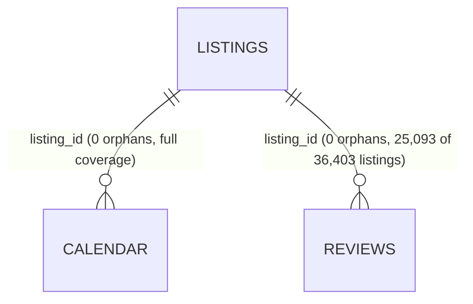

# Phase 3 — Data Discovery Summary

**Project:** Rental Market Intelligence Platform · **Snapshot:** 01 August 2025 · **Compiled:** 2026-07-14
**Scope:** Discovery & profiling only — no data was modified, cleaned, transformed, or modelled.

---

## 1. What we have

| Dataset | Rows | Cols | Size | Grain | Role |
|---|---:|---:|---:|---|---|
| listings.csv | 36,403 | 79 | ≈ 73.4 MB | 1 per listing | Master / dimension anchor |
| calendar.csv | 13,287,103 | 7 | ≈ 452.3 MB | 1 per listing per date | Daily availability fact |
| reviews.csv | 977,459 | 6 | ≈ 292.7 MB | 1 per review | Review / demand-proxy fact |

- Geography: 5 boroughs, 223 neighbourhoods. Manhattan (16,225) & Brooklyn (13,322) dominate supply.
- 21,643 distinct hosts; 861,113 distinct reviewers; review history 2009→2025; calendar covers 2025-08→2026-08.

## 2. Relationships (verified from data)

- **Primary keys:** `listings.id` (unique), `reviews.id` (unique), `calendar` = (`listing_id`,`date`).
- **Foreign keys:** both `calendar.listing_id` and `reviews.listing_id` resolve fully to `listings.id` — **0 orphans**.
- `host_id` / `reviewer_id` reference entities with **no supplied dimension table** (derivable later).

## 3. Top data-quality findings

| Sev | Finding |
|---|---|
| 🔴 | `calendar.price` & `adjusted_price` are **100% NULL** — no per-night pricing available. |
| 🔴 | `listings.price` is a **string** (`$260.00`) and **41.6% null** (only 21,279 of 36,403 priced). |
| 🟠 | Booleans stored as text `t/f` (6 columns across listings + calendar). |
| 🟠 | Percentages stored as text (`host_response_rate`, `host_acceptance_rate`, ~40% null). |
| 🟠 | Integer sentinel `2,147,483,647` in `maximum_nights` family; price/beds/min_nights outliers. |
| 🟠 | Dead/degenerate columns: `calendar_updated` (100% null), `neighbourhood` (1 value), `scrape_id` (constant). |
| 🟡 | 31% of listings have no reviews → review-based metrics undefined there (structural). |
| ✅ | **No duplicate rows or duplicate primary keys** in any dataset; **no orphan foreign keys**. |

## 4. Business questions — verdict

| Question | Verdict | Note |
|---|---|---|
| Highest-price neighbourhoods | ✅ Yes | via `listings.price` (cast); use median; 41.6% null caveat |
| Highest-supply neighbourhoods | ✅ Yes | listing counts by geography (0 nulls) |
| Prices over time | ❌ No | calendar price empty + single snapshot |
| Occupancy estimate | 🟡 Estimate | `estimated_occupancy_l365d`, availability, or review-based proxy |
| Demand estimate | 🟡 Proxy | review volume over time (assumes constant review rate) |
| Actual bookings / revenue | ❌ No | no transaction data; only vendor estimates |

## 5. Engineering signal (candidates, not designed)

- **Bronze:** raw as-is, UTF-8, multiline-aware parse, capture `scrape_id`/load metadata.
- **Silver:** cast price/%/booleans/dates, parse `amenities`, treat sentinels & outliers, reconcile `bathrooms`↔`bathrooms_text`, keep nulls explicit.
- **Gold candidates:** price (median by geo/type), supply counts, availability/occupancy, review-based demand, quality scores.
- **Dims:** Listing, Host, Neighbourhood/Borough, Date, (Guest, Property/Room type).
- **Facts:** Availability (daily), Review (event), Listing Snapshot.
- **Partitioning:** calendar/reviews by `date`; listings by `scrape_id`. **Cluster/sort:** by `listing_id`, geo, `room_type`.
- **Incremental:** reviews append-only by date; calendar snapshot-per-scrape; listings SCD-per-scrape.

## 6. Key limitations to carry forward

1. **Single snapshot** → no listing/price history (blocks true time-series).
2. **Pricing is the primary risk** → only `listings.price` usable, and it's 41.6% null.
3. **Occupancy & demand are estimates/proxies**, never observed bookings.
4. **No host/guest/transaction/search data** → those questions are out of scope with current inputs.

## 7. Document index

| File | Contents |
|---|---|
| [dataset_overview.md](dataset_overview.md) | Rows, cols, size, grain, purpose per dataset |
| [schema_analysis.md](schema_analysis.md) | Every column: type, description, meaning, category |
| [data_profiling.md](data_profiling.md) | Nulls, cardinality, stats, distributions, dates, samples |
| [data_quality_report.md](data_quality_report.md) | All issues catalogued by severity (no fixes) |
| [relationship_analysis.md](relationship_analysis.md) | PK/FK/joins + Mermaid ER diagram |
| [business_validation.md](business_validation.md) | Column business meaning + question feasibility |
| [engineering_observations.md](engineering_observations.md) | Bronze/Silver/Gold, dims/facts, partition/cluster, incremental |
| [phase3_summary.md](phase3_summary.md) | This summary |

---

### Recommended next phase
Proceed to **Silver-layer cleaning design** targeting the price/boolean/percentage casts and the calendar-price gap, and begin collecting **additional snapshots** so price-over-time becomes answerable. Warehouse/star-schema design remains explicitly out of scope until modelling phase.

> **Verification note:** Every figure in these documents was measured directly from the raw CSVs (pandas 3.0.3, Python 3.13.7). Where a fact could not be verified from the data (e.g. true occupancy, transacted price), it is labelled as an estimate, proxy, or explicitly "cannot be answered."
