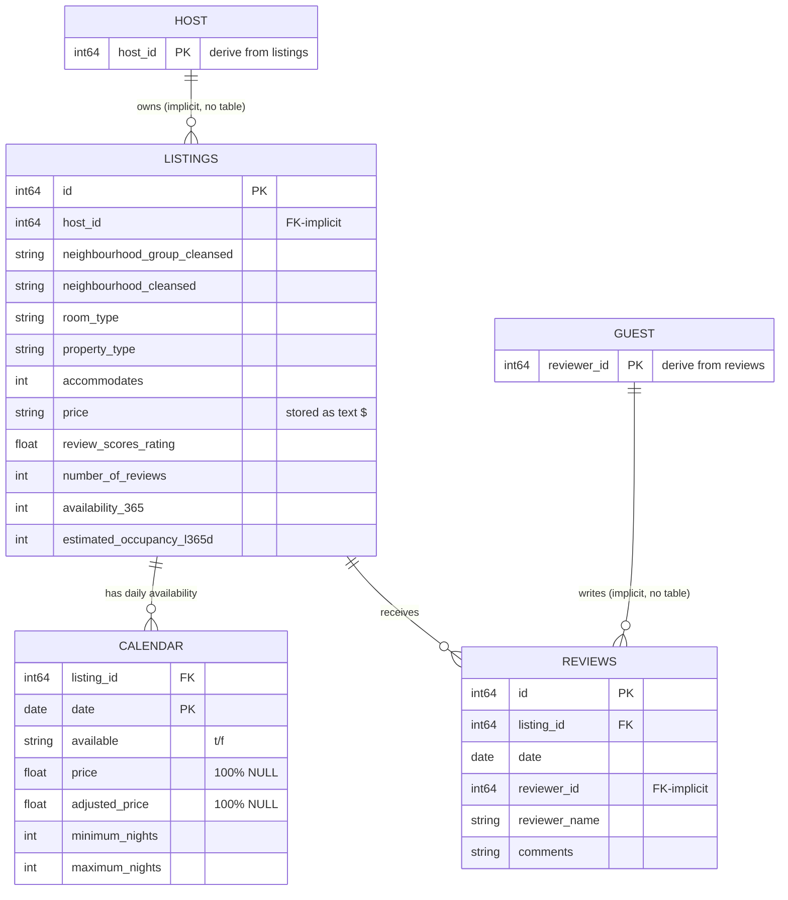

# Relationship Analysis — Phase 3 Data Discovery

All relationships below were **verified against the actual data**, not assumed from column names.

---

## 1. Primary keys

| Dataset | Primary key | Verified |
|---|---|---|
| `listings` | `id` | ✅ 36,403 rows, 36,403 distinct `id`, 0 duplicates |
| `calendar` | (`listing_id`, `date`) composite | ✅ grain is one row per listing per date (see note on 8 extra rows in [data_quality_report.md](data_quality_report.md) C6) |
| `reviews` | `id` | ✅ 977,459 rows, 0 duplicate review `id` |

## 2. Foreign keys

| From | Column | → To | Column | Integrity (measured) |
|---|---|---|---|---|
| `calendar` | `listing_id` | `listings` | `id` | ✅ 36,403 distinct FKs, **0 orphans**; set is **exactly equal** to the listings key set |
| `reviews` | `listing_id` | `listings` | `id` | ✅ 25,093 distinct FKs, **0 orphans**; strict **subset** of listings keys |
| `listings` | `host_id` | *(no host table)* | — | Implicit host grouping only; 21,643 distinct hosts. No standalone host dataset provided |
| `reviews` | `reviewer_id` | *(no reviewer table)* | — | 861,113 distinct reviewers; no reviewer dimension provided |

## 3. Join columns

| Join | Key(s) | Cardinality | Notes |
|---|---|---|---|
| listings ↔ calendar | `listings.id = calendar.listing_id` | 1 : ~365 | Every listing has a ~1-year forward calendar |
| listings ↔ reviews | `listings.id = reviews.listing_id` | 1 : 0..N | 31% of listings have 0 reviews |
| calendar ↔ reviews | (only via listings) | — | No direct key; must route through `listings` |

## 4. Relationship characteristics

- **listings → calendar** is a **complete (total) 1-to-many**: the calendar `listing_id` set equals the listings key set exactly. No listing lacks a calendar; no calendar row references a missing listing.
- **listings → reviews** is a **partial 1-to-many**: only reviewed listings appear. This matches the 11,310 listings with null `first_review`.
- `host_id` and `reviewer_id` point to **conceptual entities that have no dimension table** in this delivery. If a Host or Guest dimension is needed later, it must be **derived** from `listings` / `reviews` respectively.

## 5. ER diagram

## 6. Implications for modelling (not designed yet)

- `listings` is the natural **conformed dimension anchor** (listing + geography + host attributes).
- `calendar` is a **date-grained fact** (availability), and `reviews` is an **event-grained fact** (review/demand proxy), both joinable to `listings` on the listing key.
- A shared **Date dimension** could conform `calendar.date` and `reviews.date`.
- Host and Guest dimensions, if required, are **derivable but not supplied**.
